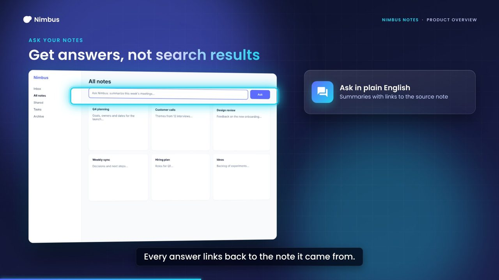

# explainer-video

Turn a product page or brief into a **narrated, captioned explainer video**, using one JSON file and free, local tools.



- **Free voice:** [Kokoro](https://github.com/thewh1teagle/kokoro-onnx), an open-source TTS model (Apache-2.0) that runs on CPU. No API keys.
- **Exact captions:** narration is generated sentence by sentence, so captions and animations are timed to the voice.
- **No animation code to write:** pick scene types (`title`, `cards`, `screenshot`, `grid`, `compare`, `pricing`, `end`) and fill in the text.
- **Clean prices:** `$20/mo`, never `$20.00`. This is enforced automatically.
- **Web-ready output:** a 1080p MP4, plus an optional 720p MP4/WebM, a poster image and a lazy-loading embed snippet.

It works as an **Agent Skill** for Claude (see `SKILL.md`) or as plain command-line scripts.

## Quick start

```bash
bash scripts/setup.sh                       # one time: Python packages, voice model, fonts (needs ffmpeg, node/npm)
python3 scripts/tts.py examples/demo.json   # narration + timing
python3 scripts/build.py examples/demo.json # builds the animated page
python3 scripts/shots.py examples/demo.json # QA contact sheet → examples/build/qa/sheet.jpg
python3 scripts/render.py examples/demo.json --workers 4
bash scripts/encode.sh examples/demo.json   # → examples/Nimbus-Notes-Overview.mp4
bash scripts/web.sh examples/demo.json 4    # optional: 720p MP4/WebM, poster, embed snippet
```

The 37-second demo renders in about 2 minutes on 2 CPUs.

## Write your own

Copy `examples/demo.json`, then change the brand colours, logo, screenshots and lines. Each line is one sentence that is both spoken and captioned, and scene elements appear as their line is spoken. See `SKILL.md` for the full schema and rules.

## Use as a Claude skill

Put this folder in your skills directory (for example `~/.claude/skills/explainer-video/`), or upload it as a skill. Then ask Claude: *"Make an explainer video for <page or doc>."*

## Credits and licences

- Code: MIT (see `LICENSE`).
- Voice model: Kokoro-82M (Apache-2.0), via `kokoro-onnx`.
- Fonts: Poppins (SIL Open Font License) and Material Icons (Apache-2.0), fetched at setup.
- Logos and screenshots you add belong to their owners. Follow their brand guidelines.
